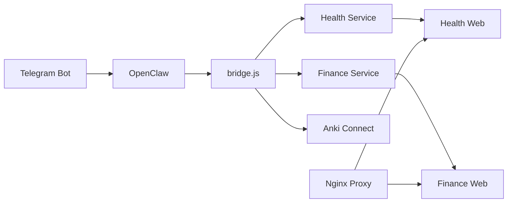

# Moltbot System Document

**Version**: 2026-02-08  
**Branch**: `codex/daily-summary-20260208`

---

## Table of Contents
1. [System Overview](#system-overview)
2. [Core Features](#core-features)
3. [Web Services](#web-services)
4. [Automation](#automation)
5. [Security](#security)
6. [Operations Guide](#operations-guide)

---

## System Overview

### Architecture


### Tech Stack
| Component | Technology |
|----------|------|
| Runtime | Node.js 20 (Alpine) |
| Database | SQLite3 |
| Proxy | Nginx 1.27 |
| Container | Docker Compose |
| AI | Gemini API |

---

## Core Features

### 1. Health Tracking (Health Service)

**File**: [health_service.js](file:///Users/moltbot/Documents/Moltbot_Workspace/scripts/health_service.js)

#### Specifications
| Item | Value |
|------|-----|
| Data store | SQLite (`data/health.db`) |
| Image upload | `HEALTH_UPLOAD_ROOT` directory |
| Supported formats | `.jpg`, `.jpeg`, `.png`, `.webp`, `.heic` |

#### Usage
```bash
# Text ingestion
node scripts/bridge.js health ingest-text "Wake up at 7 AM, weight 72kg"

# Structured data ingestion
node scripts/bridge.js health ingest-structured '{"weight":72,"wake_time":"07:00"}'

# Summary query
node scripts/bridge.js health summary week
node scripts/bridge.js health summary month 2026-02-01
```

#### Telegram Command
```
Health: Wake up at 7 AM, weight 72kg, feeling good
```

#### Implementation Status
- [x] Data ingestion (text/structured)
- [x] Image attachment
- [x] Weekly/monthly/yearly summary
- [x] Recovery index calculation
- [x] Security: Symlink validation, SQL injection defense

#### Pros and Cons
| Pros | Cons |
|------|------|
| Supports natural language input | OCR accuracy depends on AI |
| Automatic recovery index calculation | Possible DB lock under concurrent access |
| Image attachment supported | Slow with large datasets |

#### Cautions
> [!WARNING]
> Symlinks under `HEALTH_UPLOAD_ROOT` are blocked for security. Use real directories only.

---

### 2. Household Ledger (Finance Service)

**File**: [finance_webapp.js](file:///Users/moltbot/Documents/Moltbot_Workspace/scripts/finance_webapp.js)

#### Specifications
| Item | Value |
|------|-----|
| Port | `FINANCE_WEB_PORT` (default 18788) |
| Authentication | `FINANCE_WEB_API_TOKEN` header |
| Snapshot | `FINANCE_SNAPSHOT_PATH` |

#### Usage
```bash
# Start web server
npm run finance:web

# Transaction query API
curl -H "X-Api-Token: $TOKEN" http://localhost:18788/api/transactions

# Telegram command
Record: Lunch 1200 yen cash
```

#### API Endpoints
| Method | Path | Description |
|--------|------|------|
| GET | `/api/transactions` | Transaction list |
| POST | `/api/transactions` | Add transaction |
| PATCH | `/api/transactions/:id` | Edit transaction |
| GET | `/api/usage` | Category statistics |
| GET | `/api/metadata` | Category/payment method list |

#### Implementation Status
- [x] CRUD transaction management
- [x] Category/payment method stats
- [x] Snapshot + DB hybrid loading
- [x] CORS header support

#### Pros and Cons
| Pros | Cons |
|------|------|
| Natural language input | Full row memory load |
| Multi-currency support | Complex queries not supported |
| Snapshot backups | Separate dashboard needed |

---

### 3. Anki Vocabulary Integration

**File**: [bridge.js](file:///Users/moltbot/Documents/Moltbot_Workspace/scripts/bridge.js#L886-L936)

#### Specifications
| Item | Value |
|------|-----|
| Deck | `config.ankiPolicy.toeicDeck` (default `TOEIC_AI`) |
| Tags | `['moltbot', 'toeic_ai']` |
| Anki-Connect | Local port 6565 |

#### Usage
```bash
# CLI
node scripts/bridge.js word "Activated 활성화된, Formulate"

# Telegram
Word: Activated 활성화된, Formulate
```

#### Implementation Status
- [x] Automatic word enrichment (example sentences, parts of speech)
- [x] Batch add and sync
- [x] Duplicate code removal (`processWordTokens()`)

#### Pros and Cons
| Pros | Cons |
|------|------|
| AI-generated example sentences | Requires local Anki running |
| Batch processing | Timeout on network latency |
| Hint support | Anki-Connect configuration required |

---

### 4. News/Trend Collection

**File Group**: `scripts/news_*.js`

#### Implementation Status
- [x] Reddit collector (`news_collector_reddit.js`)
- [x] Trend engine (`news_trend_engine.js`)
- [x] Digest generation (`news_digest.js`)
- [ ] Telegram notification (planned)

---

## Web Services

### Docker Compose Configuration

**File**: [docker-compose.yml](file:///Users/moltbot/Documents/Moltbot_Workspace/docker-compose.yml)

```bash
# Start all services
docker compose up -d

# Start specific services only
docker compose up -d finance-web health-web

# View logs
docker compose logs -f health-web
```

### Service List
| Service | Port | Profile |
|--------|------|--------|
| `finance-web` | internal | default |
| `health-web` | internal | default |
| `prompt-web` | internal | default |
| `moltbot-proxy` | 18788 | default |
| `moltbot-web-proxy` | 18787 | default |
| `openclaw-main` | - | default |
| `openclaw-sub1` | - | `sub` |

### Environment Variables
```env
# Required
GEMINI_API_KEY=...
TELEGRAM_BOT_TOKEN=...
OPENCLAW_GATEWAY_TOKEN=...

# Web services
FINANCE_WEB_PORT=18788
FINANCE_WEB_API_TOKEN=your-secret-token
HEALTH_WEB_API_TOKEN=your-secret-token

# CORS (optional)
FINANCE_CORS_ORIGIN=https://your-domain.com
HEALTH_CORS_ORIGIN=https://your-domain.com
```

---

## Automation

### Nightly Autopilot

**File**: [nightly_autopilot.js](file:///Users/moltbot/Documents/Moltbot_Workspace/scripts/nightly_autopilot.js)

```bash
npm run nightly:autopilot
```

#### Execution Steps
1. ops-worker status check
2. Tunnel status check
3. Webapp health check (18787, 18788)
4. SEO audit
5. Backlink status
6. Blog publish
7. Notion sync
8. Model performance check

#### Output
- JSON report: `reports/nightly_autopilot_YYYYMMDD.json`
- Markdown summary: `reports/nightly_autopilot_YYYYMMDD.md`

### Token Rotation

**File**: [openclaw_rotate_tokens.js](file:///Users/moltbot/Documents/Moltbot_Workspace/scripts/openclaw_rotate_tokens.js)

```bash
# Dry run
node scripts/openclaw_rotate_tokens.js

# Apply
node scripts/openclaw_rotate_tokens.js --apply

# Apply + container restart
node scripts/openclaw_rotate_tokens.js --apply --restart
```

> [!IMPORTANT]
> Backup files(`*.bak.*`) will have tokens masked as `[REDACTED]`.

---

## Security

### Implemented Security Measures

| Area | Measure | File |
|------|------|------|
| SQL Injection | Null byte removal + quote escaping | `health_service.js` |
| Path Traversal | Validate path after symlink resolution | `health_service.js` |
| Token Leak | Remove query param auth | `health_webapp.js` |
| Secret Backup | Token masking on backup | `openclaw_rotate_tokens.js` |
| DB Lock | Exponential backoff retry | `health_service.js` |

### API Authentication
```bash
# Header auth (recommended)
curl -H "X-Api-Token: YOUR_TOKEN" http://localhost:18788/api/...

# Allow no auth (dev)
HEALTH_WEB_ALLOW_NO_AUTH=true
```

---

## Operations Guide

### Run Tests
```bash
# Full health tests
npm run test:health

# Individual tests
npm run test:health-parser
npm run test:health-security
npm run test:health-web-ui-auth
```

### Troubleshooting

| Symptom | Cause | Resolution |
|------|------|------|
| `database is locked` | Concurrent access | Auto-retry (max 3 attempts) |
| `image_path_not_allowed` | Symlink used | Use real path |
| `401 unauthorized` | Token mismatch | Check environment variables |
| Web app unresponsive | Container not started | `docker compose up -d` |

### Backups
```bash
# Manual backup
npm run openclaw:backup-sync

# Scheduled backup (cron)
0 3 * * * cd /path/to/workspace && npm run openclaw:backup-sync
```

---

## Version History

| Date | Changes |
|------|----------|
| 2026-02-08 | Security 강화, CORS, code duplicate removal |
| 2026-02-07 | Anki integration verification complete |
| 2026-02-05 | Health web app added |
| 2026-02-04 | Gemini API integration |