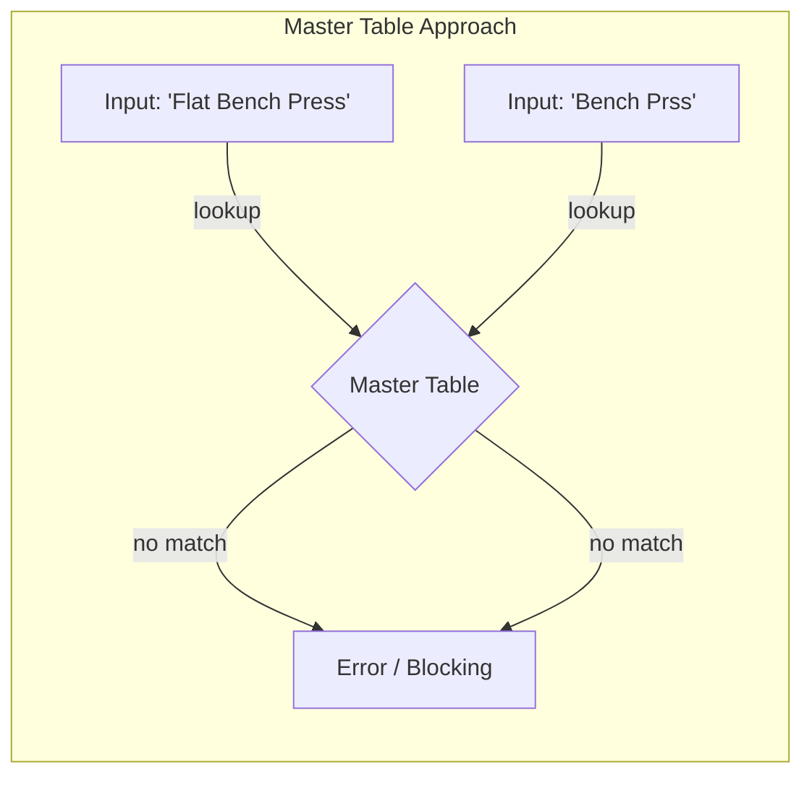

# Why I Chose a Session-Scoped Exercise Model

Every backend engineer knows the instinct.

We see a repeating string like "Bench Press" stored in multiple rows, and our brain screams: *"Normalize it!"*

The standard playbook is clear: Create an `exercises` master table. Give each exercise a unique ID. Store that ID in your `sessions` table. Add a foreign key constraint. Sleep soundly knowing your database is in Third Normal Form (3NF).

It's clean. It's correct. And for my recent personal project, **it was exactly the wrong choice.**

I built a workout tracker that processes screenshots and calculates muscle recovery. When designing the database schema, I made a conscious decision to violate standard normalization rules. Instead of a global master list, I chose a **session-scoped exercise model**.

Here’s why I did it, and what it taught me about engineering trade-offs.

---

## The Problem: The "Master Table" Trap

Let's imagine the standard approach. You create a pristine `exercises` table:

| id | name | muscle_group |
|---|---|---|
| 1 | Bench Press | Chest |
| 2 | Squat | Legs |

Now, the user uploads a screenshot. The OCR (Optical Character Recognition) reads: "Flat Bench Press".

Your system checks the master table. No match.



What happens next?

1.  **Block the user**: Ask them to manually map "Flat Bench Press" to "Bench Press". (High friction)
2.  **Auto-create**: Create a new master entry for "Flat Bench Press". (Pollutes the master list with duplicates)
3.  **Fail**: The parsing fails entirely. (Data loss)

In a user-facing analytics system, **input friction is the enemy.** If the user has to manually map every slightly different exercise name, they will stop using the app. If the system auto-creates entries, your "clean" master table becomes a garbage dump of typos ("Bench Prss"), variations ("DB Bench"), and languages ("ベンチプレス").

To maintain a clean master list, you need an administrative interface, a deduplication process, and constant vigilance. For a solo developer building an MVP, that is a massive operational burden.

---

## The Alternative: Session-Scoped Exercises

I chose a different path.

In my schema, **exercises belong to sessions, not to the system.**

When a user logs a workout, I store their raw input exactly as it appears.

**Table: exercises**
| id | session_id | raw_name | alias_key (nullable) |
|---|---|---|---|
| 101 | 50 | Flat Bench Press | bench_press |
| 102 | 51 | Bench Press (Barbell) | bench_press |
| 103 | 52 | Benchi Puresu | NULL |

The `raw_name` is the source of truth. It is immutable. It represents what the user actually did (or what the OCR actually saw).

The `alias_key` is a late-bound classification. It links the raw input to a canonical concept (like `bench_press`) *if possible*.

This means:

```mermaid
flowchart LR
    subgraph "Session-Scoped Approach (Late Binding)"
        E[Input: 'Flat Bench Press'] --> F[Stored As-Is]
        G[Input: 'Bench Prss'] --> H[Stored As-Is]
        F & H -. async mapping .-> I{Alias Table}
        I -- maps to --> J[Canonical: Bench Press]
        I -- no map --> K[Unmapped (Safe)]
    end
```

1.  **Writes are always successful.** Even if the system has never seen "Benchi Puresu" before, it saves the data.
2.  **No upfront mapping required.** The user doesn't have to stop their workflow to categorize a new exercise.
3.  **Data lineage is preserved.** If I later decide "Flat Bench" and "Incline Bench" should be treated differently, I still have the original raw names. I haven't destroyed information by forcing it into a "Bench Press" bucket too early.

---

## Trade-offs

This decision wasn't free. Engineering is always about trading one problem for another.

### The Cons (What I Paid)

**Fragmentation.** The specific string "Bench Press" might be stored thousands of times across thousands of rows. This consumes more storage than storing an integer ID. (In 2026, text storage is cheap, but it's still inefficient.)

**Reporting Complexity.** If I want to query "All Bench Press volume," I can't just query `exercise_id = 1`. I have to query by the `alias_key`. And if a record has a `NULL` alias, it's invisible to that report.

**The "Black Hole" Risk.** Without a master table enforcing validity, it's possible for a user to have 100 workouts with "Chest Press" that never get mapped to the "Chest" muscle group because of a typo. The system fails silently (or rather, passively).

### The Pros (What I Bought)

**Zero-Friction Input.** This was the critical requirement. The system accepts *anything*. A screenshot from a new app? A note typed in a rush? A gym log in Japanese? It all gets saved.

**Resilience.** The system is robust against dirty data. OCR errors don't crash the pipeline; they just result in an unmapped exercise.

**Retroactive Fixes.** Because I store the `raw_name`, I can improve the mapping logic later. I can run a background job to find all instances of "Benchi Puresu" and bulk-update their `alias_key` to `bench_press`. I couldn't do that if I had forced an incorrect mapping at ingestion time.

**Additive Development.** I don't need a perfect list of 1,000 exercises to launch. I can launch with 10 aliases. As users upload more data, I can see which `raw_names` are most common and add aliases for them. The system gets smarter over time without breaking old data.

---

## Engineering Mindset: Late Binding & Event Sourcing

This architectural choice reflects a broader engineering philosophy: **Late Binding.**

In software systems, especially those dealing with messy human input (or AI outputs), binding data to a rigid schema too early is risky. You are making assumptions about the data structure before you fully understand it.

By storing the raw intent (`raw_name`) and deferring the categorization (`alias_key`), I separate **data ingestion** from **data interpretation**.

- **Ingestion** (Creation) is high-frequency, user-critical, and must never fail.
- **Interpretation** (Mapping/Reporting) is complex, evolving, and can be improved asynchronously.

This is similar to **Event Sourcing**. The `raw_name` is the event ("User did X"). The `alias_key` is the read model (how we currently understand X). You can always rebuild the read model from the events, but you can never recover the events if you force-fit them into the wrong model initially.

## Conclusion

Normalization is a tool, not a religion.

For a banking system, strict referential integrity and normalization are non-negotiable. For a personal analytics tool dealing with noisy OCR text, flexibility and resilience are worth the cost of denormalization.

I chose the session-scoped model not because I don't know how to create a join table, but because I know the cost of maintaining one. I chose to accept messy data in the database so I could deliver a frictionless experience to the user.

And as an engineer, knowing *when* to break the rules is just as important as knowing the rules themselves.

---

*This post is based on [Health Recovery Tracker](https://github.com/INO95/health-recovery-tracker), a portfolio project exploring explainable fitness analytics.*
