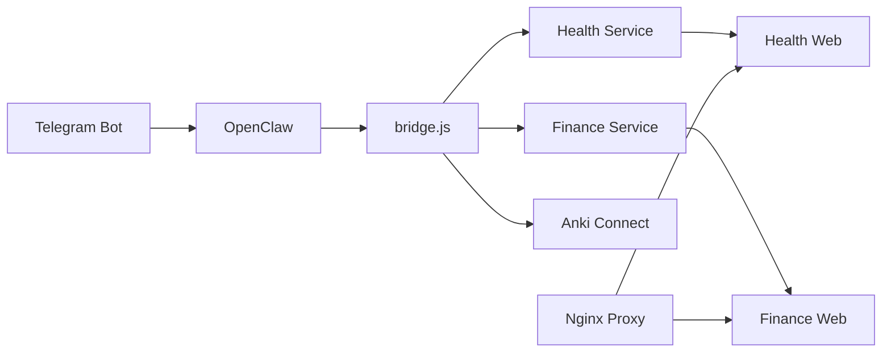

# Moltbot システム文書

**バージョン**: 2026-02-08  
**ブランチ**: `codex/daily-summary-20260208`

---

## 目次
1. [システム概要](#시스템-개요)
2. [主要機能](#핵심-기능)
3. [Web サービス](#웹-서비스)
4. [自動化](#자동화)
5. [セキュリティ](#보안)
6. [運用ガイド](#운영-가이드)

---

## システム概要

### アーキテクチャ


### 技術スタック
| 構成要素 | 技術 |
|----------|------|
| ランタイム | Node.js 20 (Alpine) |
| データベース | SQLite3 |
| プロキシ | Nginx 1.27 |
| コンテナ | Docker Compose |
| AI | Gemini API |

---

## 主要機能

### 1. 健康トラッキング (Health Service)

**ファイル**: [health_service.js](file:///Users/moltbot/Projects/Moltbot_Workspace/scripts/health_service.js)

#### 仕様
| 項目 | 値 |
|------|-----|
| データ保存先 | SQLite (`data/health.db`) |
| 画像アップロード | `HEALTH_UPLOAD_ROOT` ディレクトリ |
| 対応形式 | `.jpg`, `.jpeg`, `.png`, `.webp`, `.heic` |

#### 使用方法
```bash
# テキストインジェスト
node scripts/bridge.js health ingest-text "朝7時起床、体重72kg"

# 構造化データインジェスト
node scripts/bridge.js health ingest-structured '{"weight":72,"wake_time":"07:00"}'

# サマリー取得
node scripts/bridge.js health summary week
node scripts/bridge.js health summary month 2026-02-01
```

#### Telegram コマンド
```
건강: 朝7時起床、体重72kg、気分良好
```

#### 実装状況
- [x] データインジェスト (テキスト/構造化)
- [x] 画像添付
- [x] 週次/月次/年次サマリー
- [x] 回復指数計算
- [x] セキュリティ: Symlink 検証, SQL インジェクション防御

#### 長所・短所
| 長所 | 短所 |
|------|------|
| 自然言語入力対応 | OCR 精度が AI 依存 |
| 自動回復指数計算 | 同時接続時に DB ロックの可能性 |
| 画像添付可能 | 大容量データ時に遅い |

#### 注意点
> [!WARNING]
> `HEALTH_UPLOAD_ROOT` の symlink はセキュリティ上ブロックされます。実ディレクトリのみ使用してください。

---

### 2. 家計簿 (Finance Service)

**ファイル**: [finance_webapp.js](file:///Users/moltbot/Projects/Moltbot_Workspace/scripts/finance_webapp.js)

#### 仕様
| 項目 | 値 |
|------|-----|
| ポート | `FINANCE_WEB_PORT` (デフォルト 18788) |
| 認証 | `FINANCE_WEB_API_TOKEN` ヘッダー |
| スナップショット | `FINANCE_SNAPSHOT_PATH` |

#### 使用方法
```bash
# Web サーバー起動
npm run finance:web

# 取引照会 API
curl -H "X-Api-Token: $TOKEN" http://localhost:18788/api/transactions

# Telegram コマンド
기록: 昼食 1200엔 現金
```

#### API エンドポイント
| Method | Path | 説明 |
|--------|------|------|
| GET | `/api/transactions` | 取引一覧 |
| POST | `/api/transactions` | 取引追加 |
| PATCH | `/api/transactions/:id` | 取引修正 |
| GET | `/api/usage` | カテゴリ別統計 |
| GET | `/api/metadata` | カテゴリ/決済手段一覧 |

#### 実装状況
- [x] CRUD 取引管理
- [x] カテゴリ/決済手段統計
- [x] スナップショット + DB ハイブリッドロード
- [x] CORS ヘッダー対応

#### 長所・短所
| 長所 | 短所 |
|------|------|
| 自然言語入力 | 全行メモリロード |
| 多通貨対応 | 複雑なクエリ未対応 |
| スナップショットバックアップ | ダッシュボードが別途必要 |

---

### 3. Anki 単語帳連携

**ファイル**: [bridge.js](file:///Users/moltbot/Projects/Moltbot_Workspace/scripts/bridge.js#L886-L936)

#### 仕様
| 項目 | 値 |
|------|-----|
| デッキ | `config.ankiPolicy.toeicDeck` (デフォルト `TOEIC_AI`) |
| タグ | `['moltbot', 'toeic_ai']` |
| Anki-Connect | ローカル 6565 ポート |

#### 使用方法
```bash
# CLI
node scripts/bridge.js word "Activated 活性化された, Formulate"

# Telegram
단어: Activated 活性化された, Formulate
```

#### 実装状況
- [x] 単語自動エンリッチ (例文、品詞)
- [x] バッチ追加および sync
- [x] 重複コード削除 (`processWordTokens()`)

#### 長所・短所
| 長所 | 短所 |
|------|------|
| AI 例文自動生成 | Anki ローカル実行が必要 |
| バッチ処理 | ネットワーク遅延時にタイムアウト |
| ヒント対応 | Anki-Connect 設定が必要 |

---

### 4. ニュース/トレンド収集

**ファイル グループ**: `scripts/news_*.js`

#### 実装状況
- [x] Reddit 収集器 (`news_collector_reddit.js`)
- [x] トレンドエンジン (`news_trend_engine.js`)
- [x] ダイジェスト生成 (`news_digest.js`)
- [ ] Telegram 通知 (予定)

---

## Web サービス

### Docker Compose 構成

**ファイル**: [docker-compose.yml](file:///Users/moltbot/Projects/Moltbot_Workspace/docker-compose.yml)

```bash
# 全サービス開始
docker compose up -d

# 特定サービスのみ開始
docker compose up -d finance-web health-web

# ログ確認
docker compose logs -f health-web
```

### サービス一覧
| サービス | ポート | プロファイル |
|--------|------|--------|
| `finance-web` | 内部 | default |
| `health-web` | 内部 | default |
| `prompt-web` | 内部 | default |
| `moltbot-proxy` | 18788 | default |
| `moltbot-web-proxy` | 18787 | default |
| `openclaw-main` | - | default |
| `openclaw-sub1` | - | `sub` |

### 環境変数
```env
# 必須
GEMINI_API_KEY=...
TELEGRAM_BOT_TOKEN=...
OPENCLAW_GATEWAY_TOKEN=...

# Web サービス
FINANCE_WEB_PORT=18788
FINANCE_WEB_API_TOKEN=your-secret-token
HEALTH_WEB_API_TOKEN=your-secret-token

# CORS (任意)
FINANCE_CORS_ORIGIN=https://your-domain.com
HEALTH_CORS_ORIGIN=https://your-domain.com
```

---

## 自動化

### Nightly Autopilot

**ファイル**: [nightly_autopilot.js](file:///Users/moltbot/Projects/Moltbot_Workspace/scripts/nightly_autopilot.js)

```bash
npm run nightly:autopilot
```

#### 実行ステップ
1. ops-worker 状態点検
2. トンネル状態確認
3. Web アプリヘルスチェック (18787, 18788)
4. SEO 監査
5. バックリンク状態
6. ブログ発行
7. Notion 同期
8. モデル性能チェック

#### 出力
- JSON レポート: `reports/nightly_autopilot_YYYYMMDD.json`
- Markdown サマリー: `reports/nightly_autopilot_YYYYMMDD.md`

### トークンローテーション

**ファイル**: [openclaw_rotate_tokens.js](file:///Users/moltbot/Projects/Moltbot_Workspace/scripts/openclaw_rotate_tokens.js)

```bash
# Dry run
node scripts/openclaw_rotate_tokens.js

# 実際適用
node scripts/openclaw_rotate_tokens.js --apply

# 適用 + コンテナ再起動
node scripts/openclaw_rotate_tokens.js --apply --restart
```

> [!IMPORTANT]
> バックアップファイル(`*.bak.*`)にはトークンが `[REDACTED]` でマスクされます。

---

## セキュリティ

### 実装済みセキュリティ対策

| 領域 | 対策 | ファイル |
|------|------|------|
| SQL Injection | Null byte 除去 + quote エスケープ | `health_service.js` |
| Path Traversal | Symlink 解決後の経路検証 | `health_service.js` |
| Token Leak | Query param 認証削除 | `health_webapp.js` |
| Secret Backup | バックアップ時トークンマスキング | `openclaw_rotate_tokens.js` |
| DB Lock | Exponential backoff 再試行 | `health_service.js` |

### API 認証
```bash
# ヘッダー認証 (推奨)
curl -H "X-Api-Token: YOUR_TOKEN" http://localhost:18788/api/...

# 無認証許可 (開発用)
HEALTH_WEB_ALLOW_NO_AUTH=true
```

---

## 運用ガイド

### テスト実行
```bash
# 全体ヘルステスト
npm run test:health

# 個別テスト
npm run test:health-parser
npm run test:health-security
npm run test:health-web-ui-auth
```

### トラブルシューティング

| 症状 | 原因 | 解決 |
|------|------|------|
| `database is locked` | 同時接続 | 自動再試行 (最大 3回) |
| `image_path_not_allowed` | Symlink 使用 | 実パス使用 |
| `401 unauthorized` | トークン不一致 | 環境変数確認 |
| Web アプリ無応答 | コンテナ未起動 | `docker compose up -d` |

### バックアップ
```bash
# 手動バックアップ
npm run openclaw:backup-sync

# スケジュールバックアップ (cron)
0 3 * * * cd /path/to/workspace && npm run openclaw:backup-sync
```

---

## バージョン履歴

| 日付 | 変更内容 |
|------|----------|
| 2026-02-08 | セキュリティ強化、CORS、コード重複削除 |
| 2026-02-07 | Anki 統合検証完了 |
| 2026-02-05 | Health Web アプリ追加 |
| 2026-02-04 | Gemini API 連携 |