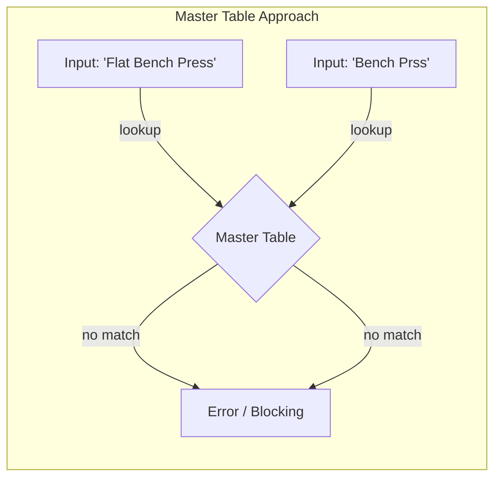

# なぜSession-Scopedな運動モデルを選択したのか

バックエンドエンジニアなら誰しも持つ本能があります。「ベンチプレス」という同一の文字列がデータベースの複数の行に重複して保存されているのを見ると、脳内で警告灯が点滅し叫びたくなるのです。「正規化（Normalize）しろ！」と。

教科書的な解決策は明確です。`exercises`マスタテーブルを作成し、一意のIDを付与し、`sessions`テーブルからそのIDを参照させます。外部キー制約を追加し、第3正規形（3NF）を達成した満足感の中で眠りにつけばいいのです。

それはクリーンで、理論的には正しい。しかし今回の私の個人プロジェクトにおいて、**それは完全に誤った選択でした。**

私はワークアウトのスクリーンショットを読み取り、筋肉の回復度を計算するアプリを作成しました。データベーススキーマを設計する際、意識的に正規化のルールを破りました。グローバルなマスタリストの代わりに、**セッションスコープ（Session-Scoped）な運動モデル**を選択したのです。

なぜそのような判断を下したのか、そしてそこから学んだエンジニアリングのトレードオフについて共有します。

---

## 問題：「マスタテーブル」の罠

標準的なアプローチを想像してみましょう。完璧な`exercises`テーブルを作成します：

| id | name | muscle_group |
|---|---|---|
| 1 | Bench Press | Chest |
| 2 | Squat | Legs |

ここでユーザーがスクリーンショットをアップロードします。OCR機能がテキストを読み取ります：「Flat Bench Press」。

マスタテーブルを検索します。一致するものがありません。



システムはどうすべきでしょうか？

1.  **ユーザーをブロックする**：「Flat Bench Pressとは何ですか？ Bench Pressとマッピングしてください」と尋ねる。（最悪のユーザー体験）
2.  **自動生成する**：マスタテーブルに「Flat Bench Press」を新規作成する。（マスタテーブルが「Bench Prss」「DB Bench」「ベンチプレス」といった表記揺れや誤字で汚染される）
3.  **失敗する**：保存を諦める。（データ損失）

ユーザー対面のアナリティクスシステムにおいて、**入力の摩擦（Input Friction）**は敵です。少し名前が違うだけですべてマッピングを要求されたら、ユーザーはアプリを使わなくなるでしょう。かといって自動生成を許可すれば、「クリーン」だったはずのマスタテーブルはすぐにゴミ捨て場と化します。これを維持するには管理画面や重複排除ロジックが必要になります。

MVPを目指す個人の開発者にとって、これは許容できない運用コストです。

---

## 代替案：Session-Scopedモデル

私は別の道を選びました。

私のスキーマでは、**エクササイズはシステムではなく、セッションに帰属します。**
ユーザーが記録を行うと、その**入力値そのまま（Raw Input）**を保存します。

**Table: exercises**
| id | session_id | raw_name | alias_key (nullable) |
|---|---|---|---|
| 101 | 50 | Flat Bench Press | bench_press |
| 102 | 51 | Bench Press (Barbell) | bench_press |
| 103 | 52 | Benchi Puresu | NULL |

`raw_name`は不変の真実（Source of Truth）です。ユーザーが実際に入力した（あるいはOCRが読み取った）値です。
`alias_key`は後から付与される分類タグです。生の入力を`bench_press`という標準的な概念に紐付けますが、それは*可能な場合のみ*です。

このモデルの意味すること：

```mermaid
flowchart LR
    subgraph "Session-Scoped Approach (Late Binding)"
        E[Input: 'Flat Bench Press'] --> F[Stored As-Is]
        G[Input: 'Bench Prss'] --> H[Stored As-Is]
        F & H -. async mapping .-> I{Alias Table}
        I -- maps to --> J[Canonical: Bench Press]
        I -- no map --> K[Unmapped (Safe)]
    end
```

1.  **書き込み（Write）は常に成功する。** システムが「Benchi Puresu」を初めて見たとしても、データは保存されます。
2.  **事前のマッピングが不要。** ユーザーは新しい種目のために操作を中断する必要がありません。
3.  **データの原型が保存される。** 後で「Flat Bench」と「Incline Bench」を区別したくなっても、元の`raw_name`が残っているため、いつでも再分類可能です。早い段階で「Bench Press」に丸めて保存していたら不可能だったでしょう。

---

## トレードオフ

エンジニアリングは常に交換条件です。

### 支払ったコスト (Cons)

**断片化（Fragmentation）**
「Bench Press」という文字列が何千回も重複して保存されます。整数IDを保存するよりストレージを消費します。（2026年現在、テキスト保存のコストは無視できるレベルですが、非効率であることは事実です）

**集計の複雑さ**
「ベンチプレスの総負荷量」を知りたい場合、`alias_key`でグルーピングして検索する必要があります。もしエイリアスが`NULL`の（マッピングされていない）記録があれば、そのデータはレポートから漏れてしまいます。

**「ブラックホール」リスク**
誤った入力（「Chest Prss」）が永遠にマッピングされず、実際には胸のトレーニングをしたのにシステムがそれを認識しない状況が発生し得ます。システムはエラーを吐く代わりに、静かに無視（Passively fail）します。

### 得たもの (Pros)

**入力摩擦ゼロ（Zero-Friction Input）**
これが最重要要件でした。新しいアプリのスクショ？ 急いで入力したメモ？ 日本語の記録？ システムはすべてを受け入れます。

**回復力（Resilience）**
汚いデータ（Dirty Data）に対して堅牢です。OCRがテキストを多少読み間違えても、パイプラインはクラッシュしません。単に「マッピングされていないエクササイズ」として残るだけです。

**遡及的な修正（Retroactive Fixes）**
`raw_name`を保持しているため、マッピングロジックを後から改善できます。「Benchi Puresu」のようなパターンが多く見つかれば、バックグラウンドジョブで一括更新して`alias_key`を付与できます。

**漸進的な開発（Additive Development）**
1,000種目のマスタリストを事前に用意する必要がありません。主要な10種目だけでリリースできます。データが蓄積されたら、頻出する種目から順にエイリアスを追加していけば良いのです。

---

## エンジニアリング的思考：遅延バインディングとイベントソーシング

この設計は、**「遅延バインディング（Late Binding）」**という広範なエンジニアリング哲学を反映しています。

人間の入力やAIの出力のようにノイズの多いデータを扱う場合、あまりに早い段階で厳格なスキーマにデータを縛り付けるのはリスクがあります。データを完全に理解する前に構造を固定してしまうことになるからです。

生の意図（`raw_name`）と解釈（`alias_key`）を分離することで、私は**データの取り込み（Ingestion）**と**データの解釈（Interpretation）**を切り離しました。

- **取り込み**は頻度が高く、ユーザー体験に直結するため、決して失敗してはいけません。
- **解釈**は複雑で変化し続けるものであり、非同期に改善していけば良いものです。

これは**イベントソーシング（Event Sourcing）**にも似ています。`raw_name`は「ユーザーがXを行った」というイベントであり、`alias_key`はそのイベントを現在どう理解しているかを示すリードモデル（Read Model）です。解釈はいつでも再構築できますが、元のイベントは一度丸めてしまうと二度と復元できません。

## 結論

**正規化はツールであり、宗教ではありません。**

銀行システムであれば、厳格な参照整合性と正規化は交渉の余地のない必須事項でしょう。しかし、ノイズの混じったOCRテキストを扱う個人用の分析ツールにおいては、柔軟性と回復力が正規化よりも価値を持ちます。

私がセッションスコープモデルを選んだのは、結合テーブルの作り方を知らないからではなく、それを維持するコストを知っているからです。データベースにおける多少の無秩序を受け入れることで、ユーザーに滑らかな体験を提供することを選んだのです。

ルールを知っていることと同じくらい、**いつルールを破るべきかを知っていること**が、エンジニアの能力です。

---
*この記事は、ポートフォリオプロジェクト [Health Recovery Tracker](https://github.com/INO95/health-recovery-tracker) のデータモデリングプロセスに基づいています。*
