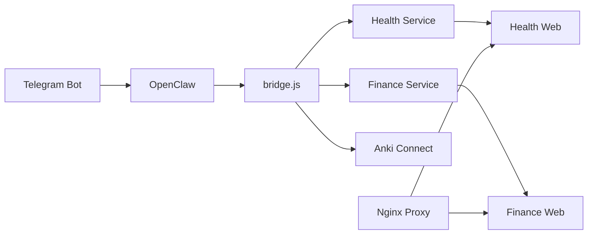

# Moltbot 시스템 문서

**버전**: 2026-02-08  
**브랜치**: `codex/daily-summary-20260208`

---

## 목차
1. [시스템 개요](#시스템-개요)
2. [핵심 기능](#핵심-기능)
3. [웹 서비스](#웹-서비스)
4. [자동화](#자동화)
5. [보안](#보안)
6. [운영 가이드](#운영-가이드)

---

## 시스템 개요

### 아키텍처


### 기술 스택
| 구성요소 | 기술 |
|----------|------|
| 런타임 | Node.js 20 (Alpine) |
| 데이터베이스 | SQLite3 |
| 프록시 | Nginx 1.27 |
| 컨테이너 | Docker Compose |
| AI | Gemini API |

---

## 핵심 기능

### 1. 건강 추적 (Health Service)

**파일**: [health_service.js](file:///Users/moltbot/Projects/Moltbot_Workspace/scripts/health_service.js)

#### 사양
| 항목 | 값 |
|------|-----|
| 데이터 저장소 | SQLite (`data/health.db`) |
| 이미지 업로드 | `HEALTH_UPLOAD_ROOT` 디렉토리 |
| 지원 형식 | `.jpg`, `.jpeg`, `.png`, `.webp`, `.heic` |

#### 사용법
```bash
# 텍스트 ingestion
node scripts/bridge.js health ingest-text "아침 7시 기상, 체중 72kg"

# 구조화 데이터 ingestion
node scripts/bridge.js health ingest-structured '{"weight":72,"wake_time":"07:00"}'

# 요약 조회
node scripts/bridge.js health summary week
node scripts/bridge.js health summary month 2026-02-01
```

#### Telegram 명령어
```
건강: 아침 7시 기상, 체중 72kg, 기분 좋음
```

#### 구현 상태
- [x] 데이터 ingestion (텍스트/구조화)
- [x] 이미지 첨부
- [x] 주간/월간/연간 요약
- [x] 회복 지수 계산
- [x] 보안: Symlink 검증, SQL 인젝션 방어

#### 장단점
| 장점 | 단점 |
|------|------|
| 자연어 입력 지원 | OCR 정확도 AI 의존 |
| 자동 회복 지수 계산 | 동시 접속 시 DB 락 가능 |
| 이미지 첨부 가능 | 대용량 데이터 시 느림 |

#### 주의점
> [!WARNING]
> `HEALTH_UPLOAD_ROOT`의 symlink는 보안상 차단됩니다. 실제 디렉토리만 사용하세요.

---

### 2. 가계부 (Finance Service)

**파일**: [finance_webapp.js](file:///Users/moltbot/Projects/Moltbot_Workspace/scripts/finance_webapp.js)

#### 사양
| 항목 | 값 |
|------|-----|
| 포트 | `FINANCE_WEB_PORT` (기본 18788) |
| 인증 | `FINANCE_WEB_API_TOKEN` 헤더 |
| 스냅샷 | `FINANCE_SNAPSHOT_PATH` |

#### 사용법
```bash
# 웹 서버 실행
npm run finance:web

# 거래 조회 API
curl -H "X-Api-Token: $TOKEN" http://localhost:18788/api/transactions

# Telegram 명령어
기록: 점심 1200엔 현금
```

#### API 엔드포인트
| Method | Path | 설명 |
|--------|------|------|
| GET | `/api/transactions` | 거래 목록 |
| POST | `/api/transactions` | 거래 추가 |
| PATCH | `/api/transactions/:id` | 거래 수정 |
| GET | `/api/usage` | 카테고리별 통계 |
| GET | `/api/metadata` | 카테고리/결제수단 목록 |

#### 구현 상태
- [x] CRUD 거래 관리
- [x] 카테고리/결제수단 통계
- [x] 스냅샷 + DB 하이브리드 로딩
- [x] CORS 헤더 지원

#### 장단점
| 장점 | 단점 |
|------|------|
| 자연어 입력 | 전체 로우 메모리 로드 |
| 다중 통화 지원 | 복잡한 쿼리 미지원 |
| 스냅샷 백업 | 대시보드 별도 필요 |

---

### 3. Anki 단어장 연동

**파일**: [bridge.js](file:///Users/moltbot/Projects/Moltbot_Workspace/scripts/bridge.js#L886-L936)

#### 사양
| 항목 | 값 |
|------|-----|
| 덱 | `config.ankiPolicy.toeicDeck` (기본 `TOEIC_AI`) |
| 태그 | `['moltbot', 'toeic_ai']` |
| Anki-Connect | 로컬 6565 포트 |

#### 사용법
```bash
# CLI
node scripts/bridge.js word "Activated 활성화된, Formulate"

# Telegram
단어: Activated 활성화된, Formulate
```

#### 구현 상태
- [x] 단어 자동 enrichment (예문, 품사)
- [x] 배치 추가 및 sync
- [x] 중복 코드 제거 (`processWordTokens()`)

#### 장단점
| 장점 | 단점 |
|------|------|
| AI 예문 자동 생성 | Anki 로컬 실행 필요 |
| 배치 처리 | 네트워크 지연 시 타임아웃 |
| 힌트 지원 | Anki-Connect 설정 필요 |

---

### 4. 뉴스/트렌드 수집

**파일 그룹**: `scripts/news_*.js`

#### 구현 상태
- [x] Reddit 수집기 (`news_collector_reddit.js`)
- [x] 트렌드 엔진 (`news_trend_engine.js`)
- [x] 다이제스트 생성 (`news_digest.js`)
- [ ] Telegram 알림 (예정)

---

## 웹 서비스

### Docker Compose 구성

**파일**: [docker-compose.yml](file:///Users/moltbot/Projects/Moltbot_Workspace/docker-compose.yml)

```bash
# 전체 서비스 시작
docker compose up -d

# 특정 서비스만 시작
docker compose up -d finance-web health-web

# 로그 확인
docker compose logs -f health-web
```

### 서비스 목록
| 서비스 | 포트 | 프로필 |
|--------|------|--------|
| `finance-web` | 내부 | default |
| `health-web` | 내부 | default |
| `prompt-web` | 내부 | default |
| `moltbot-proxy` | 18788 | default |
| `moltbot-web-proxy` | 18787 | default |
| `openclaw-main` | - | default |
| `openclaw-sub1` | - | `sub` |

### 환경변수
```env
# 필수
GEMINI_API_KEY=...
TELEGRAM_BOT_TOKEN=...
OPENCLAW_GATEWAY_TOKEN=...

# 웹 서비스
FINANCE_WEB_PORT=18788
FINANCE_WEB_API_TOKEN=your-secret-token
HEALTH_WEB_API_TOKEN=your-secret-token

# CORS (선택)
FINANCE_CORS_ORIGIN=https://your-domain.com
HEALTH_CORS_ORIGIN=https://your-domain.com
```

---

## 자동화

### Nightly Autopilot

**파일**: [nightly_autopilot.js](file:///Users/moltbot/Projects/Moltbot_Workspace/scripts/nightly_autopilot.js)

```bash
npm run nightly:autopilot
```

#### 실행 단계
1. ops-worker 상태 점검
2. 터널 상태 확인
3. 웹앱 헬스체크 (18787, 18788)
4. SEO 감사
5. 백링크 상태
6. 블로그 발행
7. Notion 동기화
8. 모델 성능 체크

#### 출력
- JSON 리포트: `reports/nightly_autopilot_YYYYMMDD.json`
- Markdown 요약: `reports/nightly_autopilot_YYYYMMDD.md`

### 토큰 로테이션

**파일**: [openclaw_rotate_tokens.js](file:///Users/moltbot/Projects/Moltbot_Workspace/scripts/openclaw_rotate_tokens.js)

```bash
# Dry run
node scripts/openclaw_rotate_tokens.js

# 실제 적용
node scripts/openclaw_rotate_tokens.js --apply

# 적용 + 컨테이너 재시작
node scripts/openclaw_rotate_tokens.js --apply --restart
```

> [!IMPORTANT]
> 백업 파일(`*.bak.*`)에는 토큰이 `[REDACTED]`로 마스킹됩니다.

---

## 보안

### 구현된 보안 조치

| 영역 | 조치 | 파일 |
|------|------|------|
| SQL Injection | Null byte 제거 + quote 이스케이프 | `health_service.js` |
| Path Traversal | Symlink 해석 후 경로 검증 | `health_service.js` |
| Token Leak | Query param 인증 제거 | `health_webapp.js` |
| Secret Backup | 백업 시 토큰 마스킹 | `openclaw_rotate_tokens.js` |
| DB Lock | Exponential backoff 재시도 | `health_service.js` |

### API 인증
```bash
# 헤더 인증 (권장)
curl -H "X-Api-Token: YOUR_TOKEN" http://localhost:18788/api/...

# 무인증 허용 (개발용)
HEALTH_WEB_ALLOW_NO_AUTH=true
```

---

## 운영 가이드

### 테스트 실행
```bash
# 전체 헬스 테스트
npm run test:health

# 개별 테스트
npm run test:health-parser
npm run test:health-security
npm run test:health-web-ui-auth
```

### 트러블슈팅

| 증상 | 원인 | 해결 |
|------|------|------|
| `database is locked` | 동시 접속 | 자동 재시도 (최대 3회) |
| `image_path_not_allowed` | Symlink 사용 | 실제 경로 사용 |
| `401 unauthorized` | 토큰 불일치 | 환경변수 확인 |
| 웹앱 미응답 | 컨테이너 미시작 | `docker compose up -d` |

### 백업
```bash
# 수동 백업
npm run openclaw:backup-sync

# 스케줄 백업 (cron)
0 3 * * * cd /path/to/workspace && npm run openclaw:backup-sync
```

---

## 버전 히스토리

| 날짜 | 변경 내용 |
|------|----------|
| 2026-02-08 | 보안 강화, CORS, 코드 중복 제거 |
| 2026-02-07 | Anki 통합 검증 완료 |
| 2026-02-05 | Health 웹앱 추가 |
| 2026-02-04 | Gemini API 연동 |
