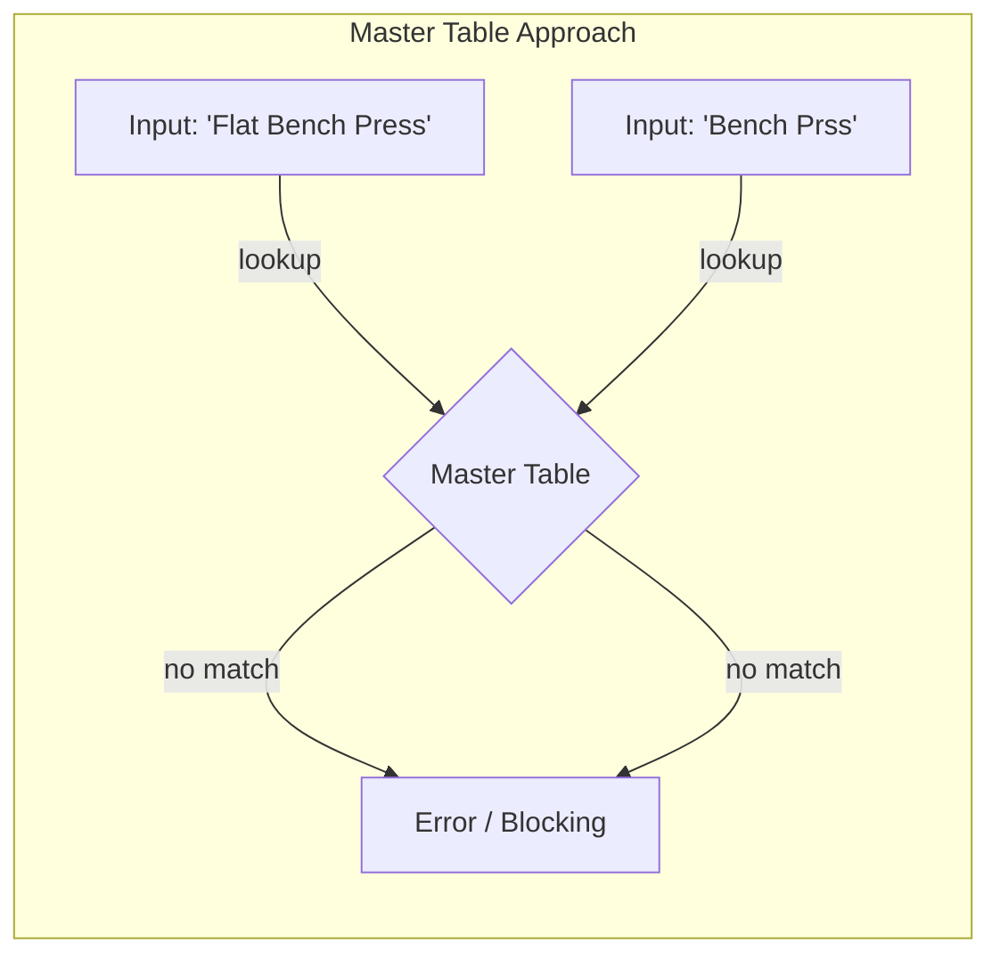

# 나는 왜 Session-Scoped 운동 모델을 선택했나

백엔드 엔지니어라면 누구나 겪는 본능이 있습니다.
"벤치프레스"라는 똑같은 문자열이 데이터베이스 여러 행에 중복 저장되는 꼴을 보면, 뇌에서 경고등이 울리죠. *"정규화(Normalize) 해야 해!"*

교과서적인 해법은 명확합니다: `exercises` 마스터 테이블을 만들고, 유니크 ID를 부여하고, `sessions` 테이블에서 그 ID를 참조하게 합니다. 외래 키(Foreign Key)를 걸고, 제3정규형(3NF)을 달성했다는 만족감 속에 잠들면 됩니다.

깔끔하고, 이론적으로 옳습니다. 하지만 이번 제 개인 프로젝트에서 **그것은 완전히 틀린 선택이었습니다.**

저는 운동 스크린샷을 읽어 회복도를 계산하는 앱을 만들었습니다. 그리고 DB 스키마를 짤 때, 의도적으로 정규화 규칙을 어겼습니다. 글로벌 마스터 리스트 대신, **세션 스코프(Session-Scoped) 운동 모델**을 선택했죠.

왜 그런 선택을 했는지, 그 과정에서 배운 트레이드오프에 대해 이야기해보려 합니다.

---

## 문제: "마스터 테이블"의 함정

표준적인 접근법을 상상해봅시다. 완벽한 `exercises` 테이블을 만듭니다:

| id | name | muscle_group |
|---|---|---|
| 1 | Bench Press | Chest |
| 2 | Squat | Legs |

이제 유저가 스크린샷을 올립니다. OCR이 텍스트를 읽어냅니다: "Flat Bench Press".

마스터 테이블을 조회합니다. 일치하는 게 없습니다.



이제 시스템은 어떻게 해야 할까요?

1.  **유저 차단**: "Flat Bench Press가 뭐죠? Bench Press와 매핑해주세요."라고 묻습니다. (최악의 사용자 경험)
2.  **자동 생성**: 마스터 테이블에 "Flat Bench Press"를 새로 만듭니다. (마스터 테이블이 "Bench Prss", "DB Bench", "벤치프레스" 같은 오타와 중복으로 오염됨)
3.  **실패**: 그냥 저장을 포기합니다. (데이터 유실)

개인용 분석 도구에서 **입력 마찰(Input Friction)**은 적입니다. 매번 운동 이름을 매핑해야 한다면 유저는 떠날 겁니다. 그렇다고 자동생성을 하면, '깔끔했던' 마스터 테이블은 곧장 쓰레기장이 됩니다. 이걸 관리하려면 관리자 페이지가 필요하고, 중복 제거(Deduplication) 로직이 필요해집니다.

MVP를 만드는 1인 개발자에게 이건 감당할 수 없는 운영 비용입니다.

---

## 대안: Session-Scoped 모델

저는 다른 길을 택했습니다.

제 스키마에서 **운동은 시스템이 아니라 세션에 귀속됩니다.**
유저가 운동을 기록하면, 그 **입력값 그대로(Raw Input)** 저장합니다.

**Table: exercises**
| id | session_id | raw_name | alias_key (nullable) |
|---|---|---|---|
| 101 | 50 | Flat Bench Press | bench_press |
| 102 | 51 | Bench Press (Barbell) | bench_press |
| 103 | 52 | Benchi Puresu | NULL |

`raw_name`은 불변의 원본(Source of Truth)입니다. 유저가 실제로 입력한 값(혹은 OCR이 읽은 값)이죠.
`alias_key`는 나중에 붙는 꼬리표입니다. 원본 입력을 `bench_press`라는 표준 개념과 연결해주지만, *가능할 때만* 합니다.

이 모델의 의미:

```mermaid
flowchart LR
    subgraph "Session-Scoped Approach (Late Binding)"
        E[Input: 'Flat Bench Press'] --> F[Stored As-Is]
        G[Input: 'Bench Prss'] --> H[Stored As-Is]
        F & H -. async mapping .-> I{Alias Table}
        I -- maps to --> J[Canonical: Bench Press]
        I -- no map --> K[Unmapped (Safe)]
    end
```

1.  **쓰기(Write)는 항상 성공합니다.** 시스템이 "Benchi Puresu"를 처음 봤어도 일단 저장합니다.
2.  **사전 매핑이 필요 없습니다.** 유저는 운동 흐름을 끊을 필요가 없습니다.
3.  **데이터 원형이 보존됩니다.** 나중에 "Flat Bench"와 "Incline Bench"를 구분하고 싶어지면, 원본 `raw_name`이 남아있으니 언제든 다시 분류할 수 있습니다. 이미 "Bench Press"로 뭉뚱그려 저장해버렸다면 불가능했겠죠.

---

## 트레이드오프 (Trade-offs)

엔지니어링은 언제나 교환입니다.

### 내가 지불한 비용 (Cons)

**파편화 (Fragmentation)**
"Bench Press"라는 문자열이 수천 번 중복 저장됩니다. 정수형 ID보다 용량을 더 차지합니다. (2026년에 텍스트 저장 비용은 무시할 수준이지만, 비효율적인 건 사실입니다.)

**리포팅 복잡도**
"벤치프레스 총 볼륨"을 구하려면 `alias_key`로 묶어서 조회해야 합니다. 만약 alias가 `NULL`인(매핑 안 된) 기록이 있다면, 그 데이터는 리포트에서 누락됩니다.

**"블랙홀" 위험**
잘못된 입력("Chest Prss")이 영원히 매핑되지 않아, 실제로는 가슴 운동을 했는데도 시스템이 모르는 상황이 발생할 수 있습니다. 시스템은 오류를 뱉는 대신 조용히 무시(Passively fail)합니다.

### 내가 얻은 것 (Pros)

**무마찰 입력 (Zero-Friction Input)**
이게 핵심 요구사항이었습니다. 새로운 앱의 스크린샷? 급하게 친 메모? 일본어 기록? 뭐든 다 받아줍니다.

**회복 탄력성 (Resilience)**
지저분한 데이터(Dirty Data)에 강합니다. OCR이 텍스트를 좀 잘못 읽어도 파이프라인은 깨지지 않습니다. 그냥 '매핑 안 된 운동'으로 남을 뿐이죠.

**소급 적용 (Retroactive Fixes)**
`raw_name`을 가지고 있으니, 매핑 로직을 나중에 개선할 수 있습니다. "Benchi Puresu" 같은 패턴이 자주 보이면, 백그라운드 잡으로 일괄 업데이트해서 `alias_key`를 붙여주면 됩니다.

**점진적 개발 (Additive Development)**
1,000개 운동 리스트를 미리 만들 필요가 없습니다. 핵심 운동 10개만 가지고 출시합니다. 데이터가 쌓이면 자주 나오는 것부터 alias를 추가하면 됩니다.

---

## 엔지니어링 사고: Late Binding & Event Sourcing

이 설계는 **'지연 바인딩(Late Binding)'** 철학을 반영합니다.

사람이 입력하는 데이터나 AI가 뱉는 데이터처럼 노이즈가 많은 환경에서는, 너무 일찍 엄격한 스키마를 강요하는 게 위험합니다. 데이터를 완전히 이해하기 전에 구조를 굳히는 꼴이니까요.

원본 의도(`raw_name`)와 해석(`alias_key`)을 분리함으로써, 저는 **데이터 수집(Ingestion)**과 **데이터 해석(Interpretation)**을 떼어냈습니다.

- **수집**은 빈도가 높고 유저 경험에 치명적입니다. 절대 실패하면 안 됩니다.
- **해석**은 복잡하고 계속 변합니다. 나중에 천천히 해도 됩니다.

이는 **이벤트 소싱(Event Sourcing)**과도 비슷합니다. `raw_name`은 "유저가 X를 했다"는 이벤트고, `alias_key`는 그 이벤트를 우리가 어떻게 이해했는지 보여주는 Read Model입니다. 해석은 언제든 다시 할 수 있지만, 원본 이벤트는 한 번 뭉개면 되돌릴 수 없습니다.

## 결론

**정규화는 도구지, 종교가 아닙니다.**

은행 시스템이라면 엄격한 참조 무결성과 정규화가 필수겠죠. 하지만 노이즈 섞인 OCR 텍스트를 다루는 개인용 분석 도구에서는, 유연성과 회복 탄력성이 정규화보다 더 가치 있습니다.

저는 조인 테이블을 만들 줄 몰라서가 아니라, 그것을 유지보수하는 비용을 알기 때문에 세션 스코프 모델을 택했습니다. 데이터베이스에 약간의 무질서를 허용함으로써, 유저에게 매끄러운 경험을 제공하기로 한 것입니다.

규칙을 아는 것만큼이나, **언제 규칙을 깨야 하는지 아는 것**이 엔지니어의 능력입니다.

---
*이 글은 포트폴리오 프로젝트 [Health Recovery Tracker](https://github.com/INO95/health-recovery-tracker)의 데이터 모델링 과정을 담고 있습니다.*
